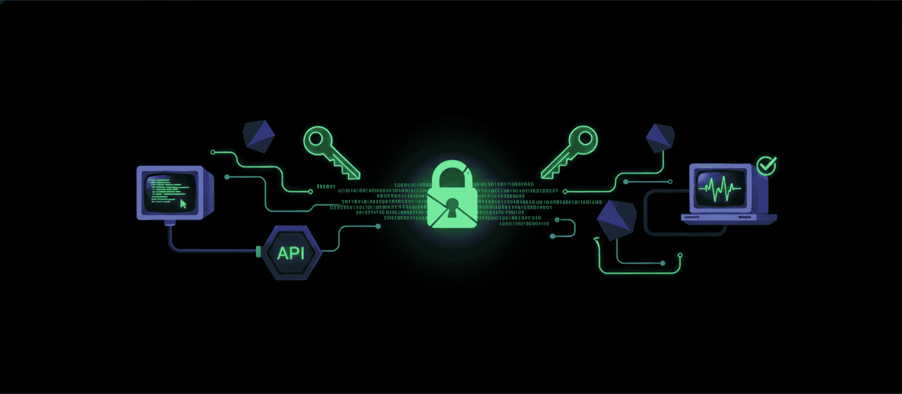

# Signed Webhook Receiver

> Verify. Trust. Process.

<p align="center">
  
</p>
<p align="center">

  

  

  

  

</p>

<p align="center">

  

  

  

  

</p>

A lightweight secure webhook gateway using RSA signature verification.

## Overview

Signed Webhook Receiver is a secure and minimal webhook service built with **FastAPI**.

It validates incoming webhook payloads using RSA digital signatures before accepting and processing data.

The receiver never trusts incoming messages unless the signature can be verified with the configured public key.

---

## Features

- RSA SHA-256 signature verification
- Secure webhook endpoint
- FastAPI + Uvicorn
- Docker ready
- Traefik compatible
- Public key based verification
- Lightweight microservice architecture

---

## Request Flow

```text
Client
  |
  | signed payload
  |
  v
Webhook Receiver
  |
  | RSA signature verification
  |
  +-- Valid signature ---> Process data
  |
  +-- Invalid signature -> 404 Not Found
```

---

## Tech Stack

- Python 3.12

- FastAPI

- Uvicorn

- Cryptography

- Docker

- Traefik

---

## API

### Endpoint

```http request
POST /api/v1/webhook
```

### Request body

```json
{
  "sign": "BASE64_SIGNATURE",
  "data": {
    "event": "payment.completed",
    "id": 123
  }
}
```

### Response

#### Successful verification:

```json
{
  "status": "ok"
}
```

#### Invalid signature:

```http request
HTTP/1.1 404 Not Found
```

---

## RSA Keys

Generate private key:

```bash
openssl genrsa -out private.pem 2048
```

Generate public key:

```bash
openssl rsa \
  -in private.pem \
  -pubout \
  -out public.pem
```

Only the `public key` is required by this service!

The `private key` must stay on the sender side.

---

## Security Notes

- Private keys must never be stored on the receiver
- Payloads must be canonicalized before signing
- Add timestamps to prevent replay attacks
- Use HTTPS in production

---

## Docker

Build:

```bash
docker build -t signed-webhook-receiver .
```

Run:

```bash
docker run -p 8000:8000 signed-webhook-receiver
```

---

## Configuration

Before running the service, configure your domain in the `.env` file.

Create a `.env` file:

```env
WEBHOOK_DOMAIN=hook.example.com
```

Replace `hook.example.com` with your own domain.

---

## Traefik Network

This project expects an existing Traefik network named proxy.

Create the network before starting the container:

```bash
docker network create proxy
```

Your Traefik instance and this service must be connected to the same Docker network.

---

## Webhook Sender Example
The sender signs the payload using the private `RSA` key.

The receiver only needs the public key to verify the signature.

Example:
```python
import json
import base64

from cryptography.hazmat.primitives import hashes
from cryptography.hazmat.primitives.asymmetric import padding


data = {
    "event": "payment.completed",
    "id": 123
}


message = json.dumps(
    data,
    separators=(",", ":"),
    sort_keys=True
).encode()


signature = private_key.sign(
    message,
    padding.PKCS1v15(),
    hashes.SHA256()
)


sign = base64.b64encode(signature).decode()


payload = {
    "sign": sign,
    "data": data
}
```

Send the generated payload to:

```http request
POST https://your-domain.com/api/v1/webhook
```

The receiver will verify the RSA signature before processing the data.


## License

MIT

